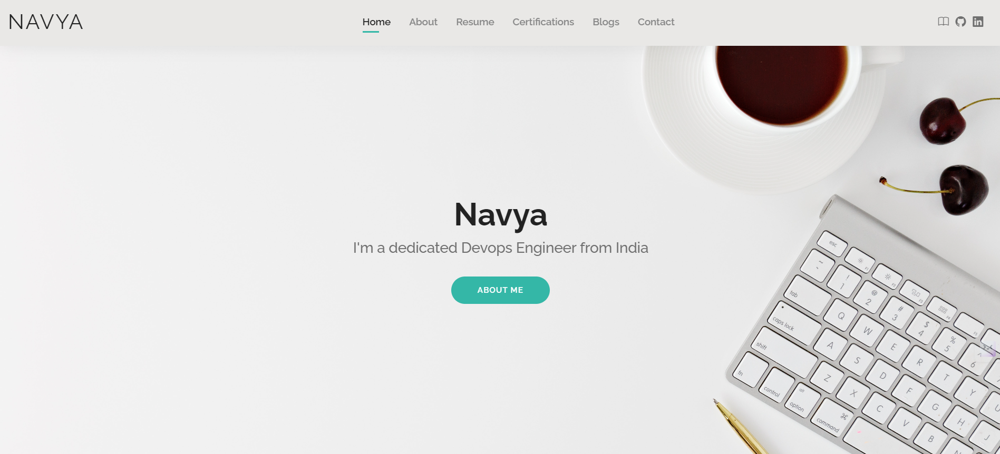

# Go Web Application

This is a simple Portfolio website written in Golang. It uses the `net/http` package to serve HTTP requests.


## Build the application Locally (Windows)

To build the application locally in windows OS, execute the following command:

```bash
go build
```
This will generate binary file. Here I am using windows, so it will create .exe file with the name of the git repository ( eg: NavyaPortfolio-GoLang.git.exe )

(or)

```bash
go build -o binary.exe .
```
This will create a "binary.exe" file. You can give anyname with .exe extension.

## Running the server

To run the server, execute the following command:

```bash
./NavyaPortfolio-Golang.git.exe
```
(or)

```bash
go run main.go
```

The server will start on port 8080. You can access it by navigating to `http://localhost:8080/home` in your web browser.

## Looks like this




